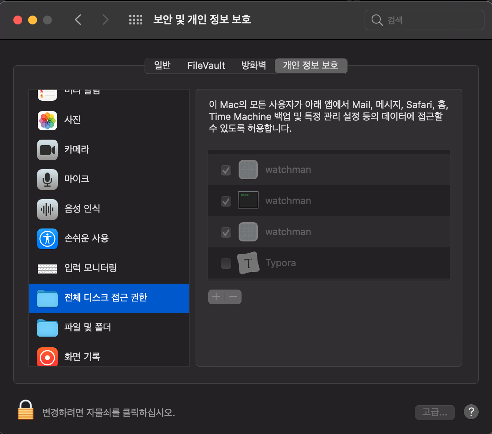
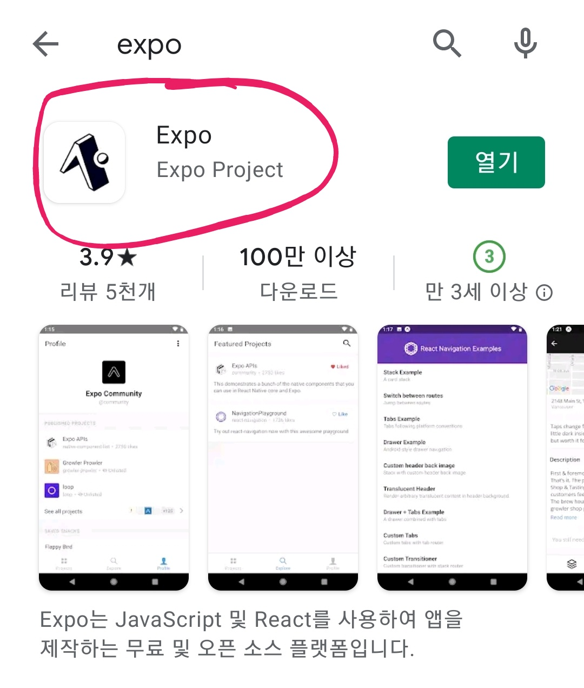

# Expo(리액트 네이티브) 가이드

## Expo(React-Native)의 특징


- Android와 iOS에서 모두 사용 가능합니다. (Web에서 빌드할 수 도 있습니다.)

- OTA(Over The Arie) 업데이트 기능을 활용하여, 플레이스토어나 앱스토어를 통하지 않고 업데이트 가능합니다. 

  하지만 개인적으로 이 업데이트에 관한 기능을 새로 만들 예정이 아니라면, 이것만을 사용해서 앱을 업데이트 하는 것을 권장하지 않습니다. 왜냐하면 스토어에서 앱 설치를 한 신규 사용자한테도 새로운 업데이트를 필요로 하기 때문입니다.  그러나 테스트용을 빌드 없이 확인하는 등, 적절히 사용하면 상당히 편리한 기능입니다.

  (아래 [빌드에 대한 챕터]((#4-expo-빌드-및-스토어에-배포하는법))에서 release-channel 기능과 관련하여 어떻게 앱을 업데이트 할 것인지에 대해 소개할 것입니다.)

- JSX(레이아웃 디자인)

  ```react
  import * as React from 'react';
  import { Text, View } from 'react-native';
  
  export default function App() {
    return (
      <View style={{ flex: 1, paddingTop: 100 }}>
        <Text>Hello, world!</Text>
      </View>
    );
  }
  ```

  React-Native의 레이아웃 디자인, JSX는 JavaScript + XML의 약어입니다. javascript 기반에 마크업(웹의 HTML 과 CSS의 작동원리와 거의 비슷합니다.)을 넣은 것입니다.  

  JSX에 대한 정확한 내용 공부는 [공식 홈페이지](https://ko.reactjs.org/docs/introducing-jsx.html)를 참고하거나 구글 검색으로 찾아보셔야 할 것 같습니다.


---


#### 유의사항

- 이 글은 아마추어가 쓴 글이라 글 내용에 오류가 많을 수도 있다는 점 주의 바랍니다.

- 글에서 나오는 모든 코드 블럭의 "..." 은 생략이라는 뜻입니다.

```javascript
... // 생략이라는 의미
```


---


## 0. 개발환경 세팅이 귀찮다면


https://snack.expo.io/


## 1. 개발환경 세팅

* ### Node.js

  react-native는 Javascript를 사용하기 때문에 먼저 Node.js를 설치해야 합니다. [Node.js 설치하기](https://nodejs.org/ko/)  
  제대로 설치 되어 환경변수까지 적용된 것을 확인하려면 터미널(윈도우는 cmd)에서 아래 명렁어를 쳐서 버전이 제대로 나오는지 확인하시면 됩니다.  
  
  ```sh
  npm -v
  ```
  
  만약 작동하지 않는다면, Node.js를 설치하지 않으셨거나 Node.js에 대한 환경변수가 등록되지 않은 것 입니다.  
  작동 안한다면 재설치 해보시고 그래도 안되시면 구글에 각 운영체제에 맞는 검색어로 찾아보시면 될 것 같습니다.    
  (ex. "윈도우 npm 환경변수", "macOS npm 환경변수")
  
  
  
  
  
  앞으로 macOS 관련하여 권한 문제가 발생할 경우, macOS 환경설정의 보안 및 개인 정보 보호로 가셔서, 전체 디스크 접근 권한 등의 탭에서 오류와 관련된 프로그램 (ex. watchman)의 권한에 체크를 해주시면 됩니다.  
  
  구글에 관련 오류를 검색하셔서, 시도해보시는 것도 좋습니다.


* ### Visual Studio Code

  react-native(+expo)의 코드 작성은 Visual Studio Code로 하는 것이 일반적이고 효율적이므로 이것으로 사용해주시기 바랍니다. 참고로 MIT 라이센스이므로 걱정없이 사용하셔도 됩니다. [Visual Studio Code 설치하기](https://code.visualstudio.com/)
  
  


* ### Expo 설치

  기본적인 환경은 전부 갖춰져 있으니, 앞으로 [Expo 공식문서](https://docs.expo.io/)를 참고하여 환경을 세팅하시고 개발을 진행하시면 됩니다.  
  아래 명령어로 npm을 사용해 expo 를 설치해주시면 됩니다.

  ```shell
  npm install --global expo-cli
  ```

  설치가 된지 확인하려면 아래 명령어를 사용해 주시면 됩니다. 설치된 버전이 출력되면 설치 된 것입니다.

  ```shell
  expo --version
  ```

  

  - 테스트를 위해 폰으로 [안드로이드 플레이스토어](https://play.google.com/store/apps/details?id=host.exp.exponent)나 [iOS 앱스토어](https://itunes.com/apps/exponent) 에서 expo라고 검색하셔서 나오는 걸 설치하시면 됩니다.  

  

  [참고한 문서](https://docs.expo.io/get-started/installation/)

  

* ### Expo 로그인

  빌드를 위해서는 expo에 로그인 해야 합니다.  
  빌드 뿐만 아니라 여러 expo의 기능을 사용하기 위해, 아래 명령어로 expo에 미리 로그인 해두는 것을 권장합니다.

  ```shell
  expo login
  ```

   [Expo 공식문서](https://docs.expo.io/)와 인터넷 검색을 통해 더 자세히 알아보실 수 있습니다.


## 2. Expo 개발 가이드

- ### **Expo 프로젝트 만들기**

  ```shell
  expo init example-app
  ```

  터미널에서 "expo init [프로젝트 이름]"을 쳐서 새로운 앱을 만들 수 있습니다.  
  blank를 선택하셔서 앱 만드는 걸 진행하시면 됩니다.  
  새로운 언어인 TypeScript를 사용하여 앱을 개발할 수도 있긴합니다. (따로 공부해야 합니다.)

  프로젝트를 만들고 나면 프로젝트명으로 폴더가 생성됩니다.  
  "cd [프로젝트 이름]"을 사용해서 프로젝트 폴더로 이동하셔야 만든 expo 앱에 대해 설정하고 사용할 수 있습니다. ("expo init" 명령어를 사용한 곳에 프로젝트 폴더가 있습니다.)

  

  ```shell
  cd example-app
  ```

   

  아래 명령어 "expo start" 를 사용하셔서 앱을 구동할 수 있도록 해주시면 됩니다.

  ```shell
  expo start 
  ```

  터미널에 QR 코드가 띄어지며 작동하는 모습이 보이면 프로젝트 실행에 성공한 것입니다.
  보통 앱을 테스트할 때 "**expo start**"를 사용합니다.  
  "expo start" 했을때 나오는 **QR 코드를 카메라로 인식**하거나, expo 앱에서 "expo login" 할때 사용한 **계정으로 로그인**하여 **테스트**하시면 됩니다.  
  "expo start"를 하면 임시로 앱을 테스트 할 수 있도록 앱 구성물들을 휴대폰에 전달해주는 서버 기능을 실행시킨 것이라고 보면 될 것 같습니다. 그러므로 테스트 중에 "expo start"를 실행시킨 터미널을 닫으면, 테스트 앱에서 오류가 날 수도 있습니다.  

- ### **기존 프로젝트 사용하기**

  새로운 expo 프로젝트를 만드는 것보다, 기존에 사용하던 프로젝트를 수정하여 사용하는 것이 덜 번거롭고 편할 것입니다.

  파일 탐색기에서 복제하거나, github에 업로드 된 프로젝트를 클론하여 사용하시면 됩니다.  
  여기서 [GitHub Desktop](#git--github-활용)으로 클론하여 사용하시는 것을 권장합니다. OS와 환경에 따라 각종 라이브러리들을 다시 설치해야 하는 경우가 많기 때문입니다.   
  git에는 직접 라이브러리 파일들이 관리되지는 않고, 아마 package.json만 관리되기 때문에 클론하신 프로젝트 폴더로 가셔서 "npm install" 명령어를 사용하시면 package.json 에 있는 패키지들이 설치될 것입니다.

  ```shell
  npm install
  ```

  혹은

  ```shell
  yarn install
  ```


- ### **Expo 패키지(라이브러리) 설치 및 적용하는 법**

  리액트 네이티브에서 사용할 수 있는 여러 패키지들은 쓸 수 없고 expo는 expo에서 제공하는 패키지만 사용가능합니다.  
  그러므로 expo로는  [Expo 공식문서](https://docs.expo.io/)에 있는 패키지만 사용할 수 있습니다.

  ```react
  import React, { PureComponent } from 'react';
  import { StyleSheet, View, Vibration, BackHandler } from 'react-native';
  import { WebView } from 'react-native-webview';
  import * as Notifications from 'expo-notifications';
  import * as Location from 'expo-location';
  ...
  ```

  App.js 등 리액트 네이티브 코드가 담긴 파일을 보면 보통 맨 위에 Java에서의 앱개발 처럼, 이런 식으로 되어 있습니다. from 뒤에 있는 "expo-notification", "expo-location" 등이 패키지입니다.

  "react"와 "react-native"를 제외하고는, 보통 따로 설치하셔야 사용하실 수 있습니다.   
  예시로 "expo-location" 등의 패키지를 설치 및 적용해보겠습니다.

  ```shell
  expo install expo-location
  ```

  터미널을 이용해 프로젝트 폴더로 가셔서 명령어로 "expo install [설치할 패키지 이름]"을 쳐서, 패키지를 설치할 수 있습니다.    

  이렇게 설치된 패키지는 아래 코드처럼 작성하여 사용할 수 있습니다.  

  ```react
  import * as Location from 'expo-location' // expo-location 패키지를 Location 이란 이름으로 사용.
  import { openURL } from 'expo-linking'; // expo-linking 패키지에서 openURL 기능만 사용.
  
  ...
  // Location이라고 이름 붙인 expo-location 패키지에서 getCurrentPositionAsync 함수를 사용.
  await Location.getCurrentPositionAsync(
    			{
            accuracy: Location.Accuracy.BestForNavigation,
            maximumAge: 1000,
            timeout: 5000
          }
        );
  ...
  // expo-linking 패키지에서 openUrl 함수를 사용.
  openURL(webUrl);
  
  ```

  [참고한 문서](https://docs.expo.io/workflow/using-libraries/)


- #### Expo의 각 파일들에 대한 설명

  *  App.js

    워크플로우 설명 ex. Dismount

    

  * ##### app.json.

    app.json은 앱에 대한 정보들을 담은 파일입니다. 

    ```json
    {
      "expo": {
        "name": "앱 이름",
        "slug": "expo에서 사용할 프로젝트 명",
        "platforms": [
          "ios",
          "android",
          "web"
        ],
        "version": "expo에서 표시할 앱의 버전",
        "orientation": "portrait",
        "icon": "./assets/아이콘으로 쓸 사진.png",
        "splash": { // 앱이 켜질때 나오는 화면 설정
          "image": "./assets/스플래시 이미지로 쓸 사진.png",
          "resizeMode": "contain",
          "backgroundColor": "스플래시 화면일때 앱" //  (ex. #FFF100)
        },
        "updates": { // Expo OTA 업데이트 관련(스토어에 업로드 하는 것이 아닌, Over The Air(OTA)업데이트로 재설치 없이 업데이트 되는 것에 관한 설정임. )
          "fallbackToCacheTimeout": 0
          //, "enabled": false 를 추가하면 OTA 업데이트 비활성화.
        },
        "assetBundlePatterns": [
          "assets/*"
        ],
        "ios": {
          "bundleIdentifier": "com.회사명.플랫폼이름", // ios 에서의 빌드 id
          "supportsTablet": true,
          "buildNumber": "ios에서의 앱 버전", // ios에서 표시할 버전, 스토어에 업로드할 때 이전 버전보다 높아야함.
          "infoPlist": { // 권한 요청시 필요한 
            ... 
          }
        },
        "android": {
          "package": "com.회사명.플랫폼이름", // 안드로이드 에서의 패키지명
          "versionCode": 1, // 안드로이드 버전 코드. 스토어에 업로드할 때 이전 버전보다 숫자가 높아야 함.
          "googleServicesFile": "./google-services.json", // firebase 사용시 필요.
          "useNextNotificationsApi": true,
          "permissions": [...] // 안드로이드 권한을 넣어줄 수 있음. (ex. 안드로이드에서 AndroidManifest.xml 파일의 "ACCESS_COARSE_LOCATION" 등의 권한)
        },
        "notification": {
          "icon": "./assets/앱에 알림왔을때 띄어줄 앱의 아이콘",
          "color": "알림 배너의 배경 색 RGB 코드", // 알림 배너의 배경색 (ex. #FFFFFF)
          "iosDisplayInForeground": true
        }
      }
    }
    
    ```

    [app.json 파일에 대한 공식문서](https://docs.expo.io/versions/latest/config/app/)에서 더 자세한 내용들을 찾아볼 수 있습니다.

    

    - 아이콘 및 스플래시 이미지

    

## 3. Expo앱 기능들 (모듈)

- ### 위치

  ```shell
  expo install expo-location
  ```

  먼저 위 명령어로 "expo-location"을 설치해주셔야 합니다. 

  아래 주석을 달아놓긴 했지만, 정확한 사용법을 알고싶다면 [공식문서](https://docs.expo.io/versions/latest/sdk/location/)를 참고하는 것을 권장드립니다.

  

  - 위치 권한 받아오는

  ```react
  import * as Location from 'expo-location';
  ...
  
  constructor(props) {
      super(props);
      this.state = {
          ....
          posx: null,
          posy: null
      };
  }
  ...
  
  componentDidMount(){
      this.requestLocationPermission(); // 위치 권한 받아오기
      this.getLocation(); // 위치 정보 받아오기
  }
  ...
  
  requestLocationPermission = async () => { // 위치 권한 받아오는 함수.
      try {
          const { status } = await Permissions.getAsync(Permissions.LOCATION); // 위치 권한 승인 유무를 status에 저장.
          if (status !== "granted") { // 위치 권한이 없다면
              await Location.requestPermissionsAsync(); // 위치 권한 요청함.
          }
      } catch (error) { }
  }
  ...
  
  // 위치를 받아오는 함수
  getLocation = async () => {
      try {
          const {
              coords: { latitude, longitude }
          } = await Location.getCurrentPositionAsync(
              {
                  accuracy: Location.Accuracy.BestForNavigation,
                  maximumAge: 1000,
                  timeout: 5000
              }
          );
          //console.log(latitude, longitude); // 위치를 제대로 가져오는지 확인할 때 쓰면 좋습니다.
          this.setState({
              posx: latitude,
              posy: longitude,
              isLoading: false
          });
      } catch (error) {
          console.log("getLocation 함수에서 오류 발생함.");
      }
  }
  
  ```

  

  

- ### 푸시

  

- ### 웹뷰

  

( [Expo앱 모듈](./module.md) 새로 만들어야 함. )


## 4. Expo 빌드 및 스토어에 배포하는법

### Android (안드로이드)

\

테스트용 apk 빌드

```shell
expo build:android --release-channel test-android
```


스토어 배포용 apk 빌드

```sh
expo build:android --release-channel play-store
```


--release-channel은 


### iOS (아이폰)

테스트용 IPA 파일 빌드

```shell
sudo expo build:ios --release-channel app-store
```


스토어 배포용 IPA 빌드

```shell
sudo expo build:ios --release-channel app-store
```

ios를 빌드할때는 sudo를 사용하여 관리자 권한으로 접근하여야 합니다.  
--release-channel은 


## 5. 각종 오류 해결 방법


## 6. 프로젝트 이어서 하기
- (node_modules 폴더를 삭제한 경우)
  기기마다 미세한 차이가 발생하기 때문에, node_modules를 삭제하고 다시 시작해야 하는 경우가 은근히 있다.
  이 node_modules 폴더를 삭제하고 다시 시작하려면, 해당 프로젝트 폴더로 가서 expo install 을 하여 expo와 관련 패키지들을 다시 설치하여주고,
  이후 npm install을 사용해 npm 관련 패키지들을 설치하여 주면 된다.


## 7. 기타

1. **강의 추천**

   [양재동 코드랩 리액트 네이티브 강의](https://youtu.be/9xzmAXbesaY)

   

2. **Git & GitHub 활용**

[GitHub Desktop](https://desktop.github.com/) 을 활용해서 버전관리 및 백업하며 개발하시는 것을 추천합니다.  
버전 관리, 협업, 백업, 공유 등을 할때 유용합니다.   
기능 전부를 활용할 필요는 없고, commit과 push만 활용해도 좋을 것 같습니다.  
[생활코딩 버전관리 강의](https://opentutorials.org/course/301) 를 참고하여 알아보시는 것 추천합니다.  


3. **깃허브 마크다운 문서 작성 방법 참고**

(한글) https://gist.github.com/ihoneymon/652be052a0727ad59601  
(영문) https://guides.github.com/features/mastering-markdown/  
**typora** 란 프로그램 사용하셔서 마크다운 수정하시면 편합니다.  (이 프로그램 사용할시 띄어쓰기는 shift + Enter)


4. **Expo 개발 웹 IDE, Snack**

Expo 관련하여 구글링 하다가 보면 

